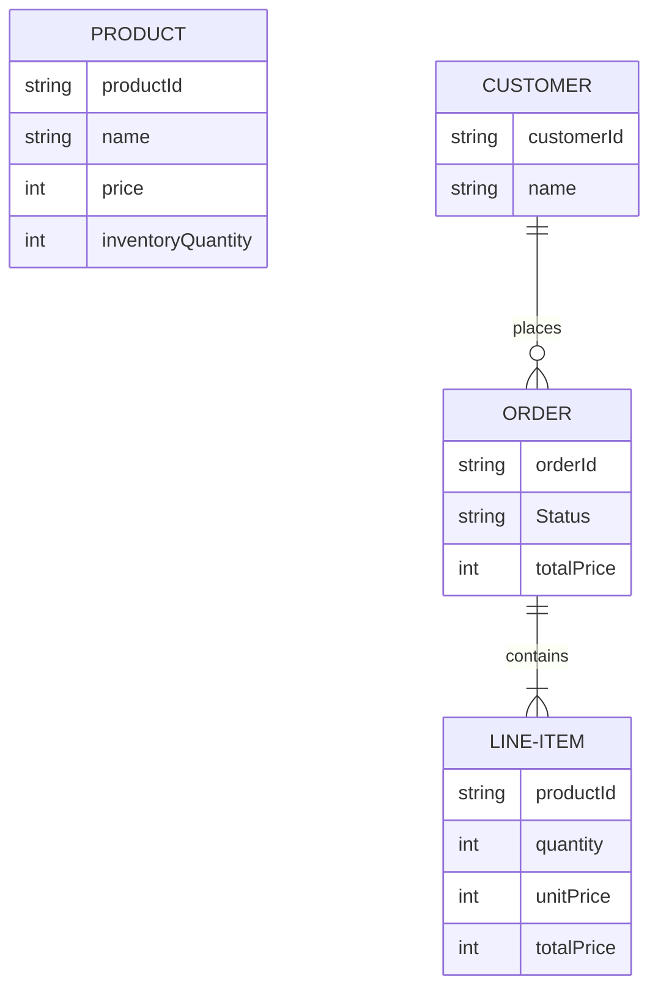
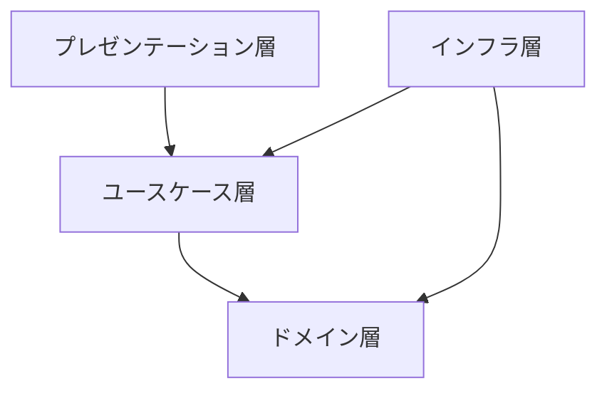
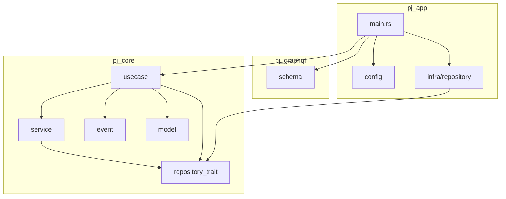

# README
Rust でクレートの分離を利用して、オニオンアーキテクチャを実現できるかの実験。

## 題材
簡易な注文システムを題材とする

## Architecture
### オニオンアーキテクチャ

[ドメイン駆動設計 モデリング/実装ガイド](https://booth.pm/ja/items/1835632)を参照

### 依存関係

### ルール
- アプリ外通信が発生する部分は全て、インフラ層に配置する。
- `pj_common`は全ての`crate`から参照可能だが、極力利用しない
